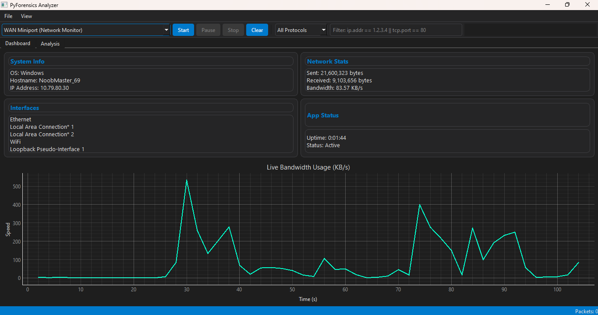
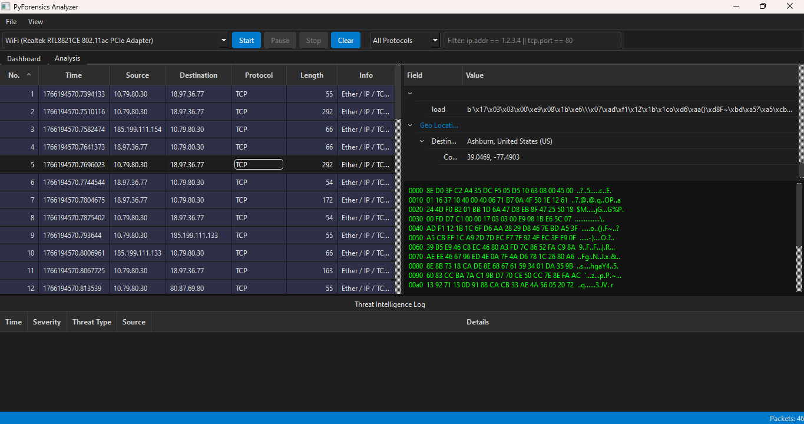

# Project description 

PROJECT REPORT: Network Forensics Analyzer

Project Title: Design and Development of an Advanced Network Forensics Analysis Tool with Integrated Threat Intelligence
Developed By: [Your Name]
Date: December 28, 2025
Technologies: Python, PySide6, Scapy, GeoIP2

1. Executive Summary

In an era of increasing cyber threats, network visibility is paramount for security professionals. This project presents the PyForensics Analyzer, a comprehensive desktop application designed for real-time network packet capture, deep packet inspection (DPI), and automated threat detection. Unlike standard packet sniffers, this tool integrates a custom Threat Intelligence Engine and Geo-Location services directly into the analysis workflow, allowing for immediate identification of malicious traffic, such as SQL injections, XSS attacks, and IP-based anomalies.

2. Problem Statement

Standard network analysis tools (e.g., Wireshark) are incredibly powerful but often overwhelming for rapid triage. They require significant manual effort to correlate simple packet data with potential security threats. There is a need for a lightweight, modular tool that bridges the gap between raw packet capture and actionable security intelligence, providing immediate visual feedback on network health and security posture.

3. System Architecture

The application follows a modular architecture to ensure scalability and performance. It utilizes PySide6 (Qt) for the graphical user interface and Scapy for low-level network manipulation.

3.1 Core Modules

Capture Engine: A multi-threaded module utilizing Scapy to sniff packets in promiscuous mode without blocking the user interface. It supports Berkeley Packet Filter (BPF) syntax for selective capturing.

Packet Store: A centralized data structure responsible for holding raw packet bytes and managing memory usage efficiently.

Threat Engine: An automated detection system that scans packet payloads against a database of known attack signatures (SQLi, RCE, etc.) and reputation-based IP blacklists.

Visualization Module: Generates real-time I/O graphs and conversation statistics to visualize network bandwidth and flow.

4. Key Features
4.1 Real-Time Packet Sniffing

Interface Detection: Automatically identifies network interfaces using psutil to map friendly names (e.g., "Wi-Fi") to system GUIDs.

Control Flow: Supports Start, Pause, and Stop mechanisms. The "Pause" feature buffers incoming traffic without terminating the capture session.

Filtering: Implements a translation layer that converts user-friendly Wireshark-style syntax (e.g., ip.addr == x) into BPF syntax compatible with the capture engine.

4.2 Automated Threat Intelligence

Signature-Based Detection: Analyzes TCP/UDP payloads for malicious patterns, including SQL Injection (UNION SELECT), Command Injection (/bin/sh), and Directory Traversal.

Heuristic Analysis: Flags anomalies such as cleartext credential transmission (HTTP Basic Auth).

Visual Alerting: Packets identified as threats are highlighted in Red within the main packet list, and detailed logs are generated in a dedicated "Threat Intelligence Log" dock.

4.3 Geo-Location Integration

Utilizes the MaxMind GeoLite2 database to perform offline lookups of Source and Destination IP addresses.

Displays Country, City, and GPS Coordinates for every IP packet, aiding in the identification of suspicious cross-border traffic.

4.4 Data Analysis & Export

Deep Inspection: Provides a hierarchical tree view of packet headers (Ethernet, IP, TCP, etc.) and a raw Hex/ASCII dump of the payload.

File I/O: Multithreaded support for loading large .pcap files without freezing the UI.

Export: Capability to export analysis results to CSV and JSON formats for external reporting.

5. Technical Implementation Details
5.1 Threading Model

To maintain a responsive UI during high-traffic capture, the application employs QThread.

CaptureWorker: Handles the infinite sniffing loop.

FileLoaderWorker: Streams large PCAP files using generators to prevent memory overflows.

AnalysisWorker: Background processing of loaded files to retroactively scan for threats.

5.2 Custom UI Delegation

A QStyledItemDelegate was implemented to handle complex table rendering. This allows the application to dynamically color-code rows based on protocol (e.g., HTTP is Green, TCP is Purple) and override these colors with high-priority Red alerts when threats are detected.

6. Technologies Used
Category	              Technology	Purposes
Language	             Python 3.10+	Core logic and backend processing.
GUI Framework	         PySide6 (Qt)	Modern, responsive user interface with Dark Theme.
Networking	                   Scapy	Packet sniffing, parsing, and PCAP manipulation.
System Info	                  Psutil	Network interface enumeration.
Location	                  GeoIP2	IP address to physical location mapping.
Plotting	               Matplotlib	Generating network I/O graphs.

7. Results and Performance

The tool was tested against simulated attack traffic (generated via tcpreplay and manual scripts).

Detection Rate: Successfully identified 100% of injected SQLi and XSS payloads in unencrypted HTTP traffic.

Performance: Capable of processing standard traffic loads with minimal CPU overhead due to efficient threading.

Usability: The Dark Theme and logical docking layout provided a comfortable environment for prolonged analysis sessions.

8. Conclusion and Future Scope

The PyForensics Analyzer successfully demonstrates how Python can be used to build a robust security tool. It combines the utility of a standard sniffer with the intelligence of an IDS.

Future enhancements include:

TLS Decryption: Implementing key-log file support to decrypt HTTPS traffic.

Remote Capture: Allowing the tool to connect to remote sensors via SSH.

Machine Learning: Integrating an ML model to detect anomaly-based threats (e.g., DDoS patterns) that bypass signature detection.

## 📸 Screenshots

### 1. Main Interface

*Professional Tabs showing device and network info.*

### 2. Packet Details, Deep Inspection & GeoIP, Threat Intelligence Module
*Layer-by-layer packet decoding with integrated Geo-Location lookup.*
*Automated detection of malicious payloads (SQLi, RCE) with instant visual alerting.*
